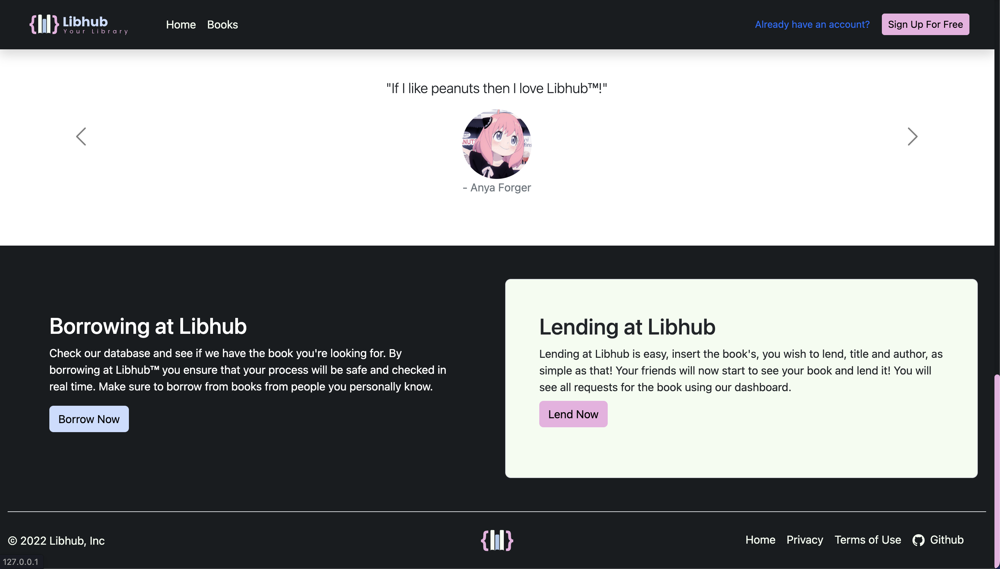

# 1.3-and-1.4-Assessment - Libhub

## **About**
Welcome to Libhub. A library, borrowing/lending, website using Flask, SQlite using the ORM Flask-SQLalchemy, Flask-Login, Bootstrap 5, SCSS and Javascript. This assessment was made for the Level 1, 1.3 and 1.4, Digital Technologies Standards for NCEA. This project took approximately 20 hours to develop.

### My Purpose
My purpose for the assessment is to develop a place where my friends can borrow and lend books to each other, all in one place, using the website as a hub *(hence the name Libhub)* to track the process of borrowing and lending books. 

---

## **Prerequistes / How to run locally**
1. Install a version of Python 3 (for which this tutorial is written). 

    - (Linux) The built-in Python 3 installation works well, but to install other Python packages you must run (bash/terminal)
        
            sudo apt install python3-pip 

2. Update pip:
        
        pip install --upgrade pip

3. Create a virtual env in VS Code

  
        python3 -m venv .venv (Mac/Linux)
  
        python -m venv .venv (Windows)

4. Accept the prompt to set this new enviornment as the new workplace settings. 

5. Install Python packages in *requirements.txt* using terminal:
        
        $ pip install -r requirements.txt --no-index --find-links file:///tmp/packages

6. Install a version of [node.js](https://nodejs.org/en/download) (latest)

7. Run `npm ci` on terminal, which downloads the node_modules fodler

8. To run put `flask run`, and click the link provided to view.
   
---

## **Libhub**
*My vision of Libhub is to provide end users (my friends) an easy, accessible and functional site to view, track, and lend books. In order to achieve that goal, I developed the website to be easy to use, accessible, functional, while maintaing visually pleasing aesthetics*

### **Features / Tutorial**

---

### The Landing 

Upon entry, you will be greeted by the landing page. Which at a glance the navbar is easily visible at the top, this sticks to the top as we scroll down the page. The navbar, itself, contains links which helps the user to navigate around Libhub. The books link takes the user to *books page* where 4 of the most recently lended books are displayed. 

Additonally, here we can see the login links, that takes you to sign-up (if you don't have an account) or to log-in. **I created a authentication process (user acccounts) for users to easily see which one borrowed or lended what book.** 
The home page is aesthetic with minimal clutter and buttons, which act as links for different parts of Libhub, and a small descripton of the website. The colours I chose were high in contrast against the background *(All images are sourced from [Unsplash](https://unsplash.com/))*, which fit under the Web Content Accessibilty Guidelines (WCAG), a universal and international guidelines for websites across the web to ensure that all content is readable and accessible. This page will also changed including the navbar once the user is logged in.
<figure>
    
    <figcaption>The homepage of Libhub (not logged in)</figcaption>
</figure>

As we scroll down the navbar still sticks at the top while giving it a solid black background. This is done to keep the navbar way from clipping to other texts as the it is originally transparent. The searchbar searches books based of the the book's title, its author, and the username of the user who lended the book. 
The cards visualises and represents Libhub's vision for a satisfactory end user experience.

- Borrow books at anytime
- Libhub's motto: 
    > *'If it exists we have it. If not start lending today'*
- Limitless control over your books

<figure>
    
    <figcaption>Searchbar and cards for <em>aesthetics</em></figcaption>
</figure>

The last part of the landing page includes the clickable carousel for testimonals *(albeit with fictonal characters)*, which was implemented to add a bit more flavour and flair to my website, as well as giving the end user a laugh, creating a sense of lightheartedness and ease as they navigate through the website. Making the overall user experience plesant to navigate and view through. 

Before the footer we have a section dedicated to explaining the lending and borrowing processes in Libhub. They also have buttons that takes you to the books page as well as the lend page (only accessible) once logged in. 

The footer, I believe, is the cherry on top. It adds a finshed look to the landing page while adding functionally. The links take you to the resepective pages, such as this Github page. While the privacy and Terms of Use links opens a seperate tab explaining the Terms and Conditons of Libhub. While this is unnecessary for website whose target audience is just my friends (interpersonal), it adds a bit of layering especailly when this project scales larger, adding more users (possibly user I don't know personally), the Privacy Policy and T&Cs declares the user's privacy rights for legal reasons. The footer is visble in most pages.

<figure>
    
    <figcaption>Testimonals Carousel, more cards for <em>aesthetics</em>, and footer</figcaption>
</figure>

---

### The Library

<figure>
    
    <figcaption>The Library</figcaption>
</figure>

